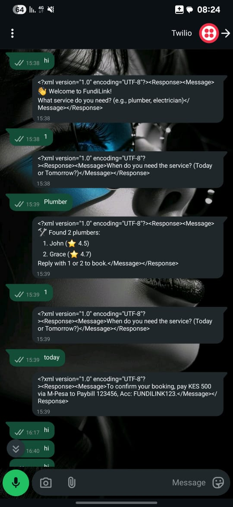

# 🤖 FundiLink - WhatsApp-Based Freelancer Booking System

FundiLink is a backend system built with **FastAPI** that connects clients to local fundis (skilled workers) via WhatsApp.  
Users can register, search for services, book a fundi, and confirm payments — all in a seamless WhatsApp chat.

---

## 🚀 Features

- 📱 Register as Client or Fundi
- 🔍 Search for Services by Category and Location
- 📅 Book a Fundi
- 💳 Confirm Payment
- 💬 WhatsApp Bot Integration using Twilio API

---

## 🛠️ Tech Stack

- **FastAPI** - API Framework
- **SQLAlchemy** - ORM for Database
- **Pydantic** - Data Validation
- **Twilio API** - WhatsApp Bot Integration
- **Uvicorn** - ASGI Server
- **Ngrok** - Local Tunnel for Webhook Testing
- **SQLite / MySQL** - Database Support

---
## **👥 Contributors**

<table>
  <tr>
    <td align="center" width="25%">
      <a href="https://github.com/amanynabil" target="_blank">
        
        <br /><b>Amany Nabil Ahmed</b>
      </a>
    </td>
    <td align="center" width="25%">
      <a href="https://github.com/nakhanu" target="_blank">
        
        <br /><b>Sophia Nakhanu</b>
      </a>
    </td>
    <td align="center" width="25%">
      <a href="https://github.com/RICCOM" target="_blank">
        
        <br /><b>Eric Munjuri</b>
      </a>
    </td>
    <td align="center" width="25%">
      <a href="https://github.com/steviedave" target="_blank">
        
        <br /><b>Stephen David Oduor</b>
      </a>
    </td>
  </tr>
</table>
---

# ⚙️ Setup Instructions
## 1️⃣ Clone the repository

git clone https://github.com/amanynmohamed/Vibe-Coding-Hackathon-2.0.git
cd Vibe-Coding-Hackathon-2.0

---
# 📸 Demo

Here’s a sample conversation between a user and FundiLink's WhatsApp bot:



## 💬 Sample WhatsApp Flow

User: hi
Bot: 👋 Welcome to FundiLink! What service do you need? (e.g., plumber, electrician)

User: plumber
Bot: ✅ Showing available plumbers near your location...

User: book plumber
Bot: 🗓️ Booking confirmed. Please confirm payment to proceed.

User: paid
Bot: ✅ Payment received. A fundi will contact you shortly.

## 📂 Project Structure

```text
FundiLink/
├── main.py             # FastAPI app and API routes
├── crud.py             # Business logic layer
├── models.py           # SQLAlchemy DB models
├── schemas.py          # Pydantic validation schemas
├── database.py         # DB connection setup
├── requirements.txt    # Dependencies list
├── README.md           # Project documentation
└── screenshot.png      # WhatsApp bot demo image

 ---
